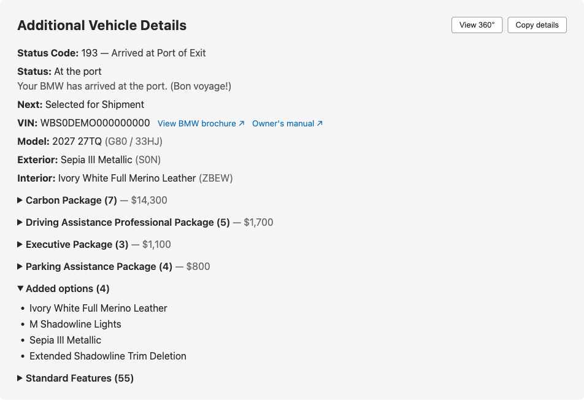

# BMW MyGarage Chrome Trick

**See everything BMW knows about your on-order car — right on the MyGarage page.**

If you've ever ordered a BMW, you know the ritual: refresh MyGarage, see "Order
received," and wonder what's *actually* happening. The answer is already in your
browser — BMW's own page downloads the full production record (status codes, dates,
the complete build sheet) and then shows you almost none of it. Enthusiasts dig it
out by hand with DevTools; this extension does it in one click.



*An actual render (status 112 order) — every line above is data BMW's page downloaded but never displayed.*

## Features

**Order tracking**
- The raw **factory status code** with its technical name (102, 111, 112, 150 …)
  plus a plain-language note at the milestones that matter — 112 is flagged as your
  *last chance to change the order*, 150 as *spec locked*.
- **Next** — the upcoming production step, from a curated milestone ladder.
- **VIN, production date, and retail date** the moment BMW assigns them — with a
  short explainer while they're still hidden (BMW's customer API withholds them
  until status 150; your dealer or the BMW Genius line can quote the scheduled
  build week earlier).

**Build sheet**
- Model with chassis code, exterior and interior with **decoded paint/upholstery
  codes** (`P0S0N → S0N`).
- Every **option package with its contents and MSRP** as priced in BMW's own feed,
  package breakdowns folded into their parent, plus the full standard-features list.
- **Copy details** exports the panel as clean plain text — ready for your order
  thread.

**Eye candy**
- **View 360°** — BMW renders a full turntable of *your exact build* for its
  configurator plumbing. One click loads all 36 frames into a drag-to-rotate viewer.

## Install

1. `git clone` this repo (or download it) — the repo *is* the unpacked extension.
2. Open `chrome://extensions/`, toggle **Developer mode** (top right).
3. Click **Load unpacked** and select the cloned folder.
4. Pin the icon to your toolbar (puzzle-piece menu → pin).

## Use

1. Sign in at [mygarage.bmwusa.com](https://mygarage.bmwusa.com/dashboard.html).
2. Click your vehicle in the top thumbnail bar.
3. Click the extension icon. That's it — click again after switching vehicles, or
   to refresh.

If BMW's page hasn't loaded the data yet, the extension fetches it directly using
the same authorized call the page itself makes.

## How it works

The extension never talks to anything except BMW. A capture script watches the
API responses BMW's own frontend already fetches and indexes them; the panel just
renders what was captured.

| File | Role |
|---|---|
| `manifest.json` | MV3 manifest, locked to `mygarage.bmwusa.com` only |
| `before.js` | Runs at `document_start` in the page's MAIN world; hooks `fetch`/`XHR` and indexes every `prodVehicleDetails` response by production number |
| `execute.js` | Runs on toolbar click; reads the selected vehicle, renders the panel (fetching via BMW's forward proxy if nothing was captured yet) |
| `background.js` | Service worker; injects `execute.js` on click |

After editing code: hit the reload arrow on `chrome://extensions/`, then reload the
BMW tab.

## Tests

Zero-dependency suite (Node 20+, no packages to install):

```bash
npm test
```

Covers the capture hooks, panel rendering (including XSS escaping and BMW's odd
payload shapes, all taken from live captures), and manifest invariants.

## Permissions & privacy

- `host_permissions`: `https://mygarage.bmwusa.com/*` — the only site it can touch.
- `scripting` — to inject the panel on click. That's the entire permission list.

Nothing leaves your browser. To fetch details on demand, the extension reuses the
`Authorization` token the page already sends — replayed only to the BMW origin,
held only in page memory for the life of the tab, never persisted.

## Compatibility

Chrome / Edge / Brave / Opera on **Chromium 111+** (the capture script relies on
static MAIN-world content scripts, added in 111). Manifest V3.

## Credits

This project modernizes the original
[BMW MyGarage Chrome Trick](https://chromewebstore.google.com/detail/bmw-mygarage-chrome-trick/lbhlbodakahplgnfbggcjajoeodfpfon)
Chrome extension by **fdfranklin06** (Chrome Web Store, 2022) — the idea of
surfacing MyGarage's hidden production data is theirs. The bundled MIT license
credits **Lawrence Lagerlof** (2021), whose earlier work the original extension
appears to build on; that notice is preserved unchanged in [LICENSE](LICENSE).

## Disclaimer

Unofficial hobby project — not affiliated with or endorsed by BMW. It reads the
data BMW's own page loads for you; field names and payload shapes can change
whenever BMW updates MyGarage.
